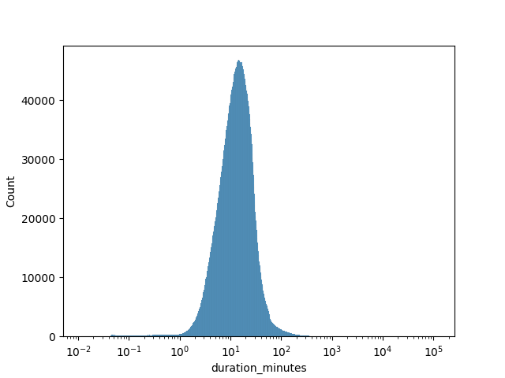
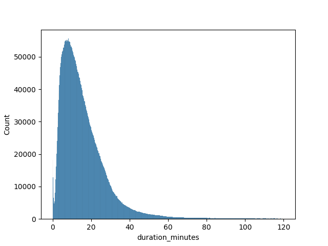
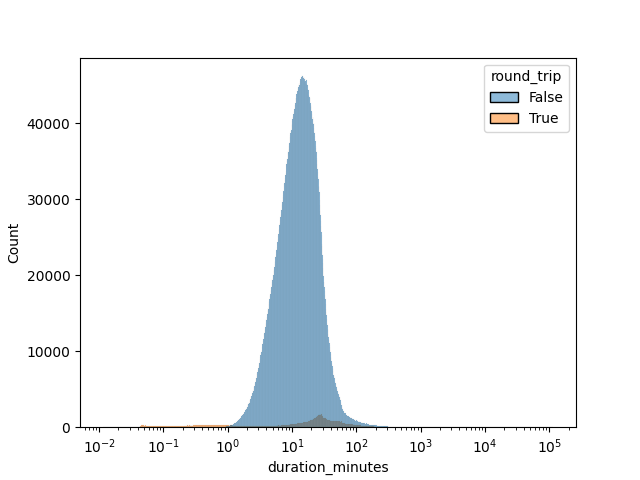
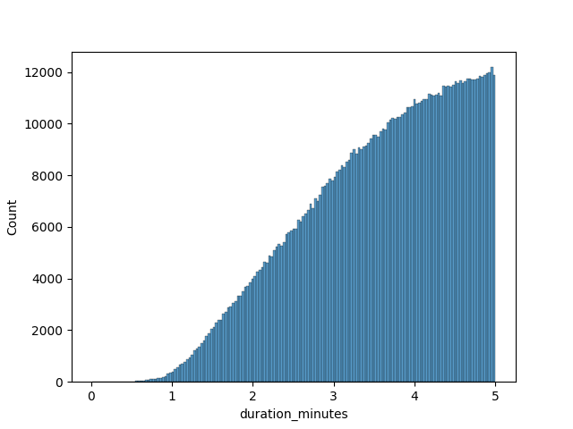

# Trips

## Trip duration

Trip duration times range from a few seconds to many days. With most them falling under around 120 minutes.





### Round-trips

Flagging trips with the same start and end station as round trips reveals some insigts.

Round trips are much less common than one-way trips.

```sql
SELECT
  (station_end_id == station_start_id) AS round_trip,
  COUNT(*) as count
FROM trips_raw
GROUP BY round_trip;

┌────────────┬─────────┐
│ round_trip │  count  │
│  boolean   │  int64  │
├────────────┼─────────┤
│ false      │ 8434689 │
│ true       │  320463 │
└────────────┴─────────┘
```



Closer inspection of round trips reveals a double mode.


Some possible causes:

- **short trips**:
  - users changing their mind about using the bike
  - users testing the app functionality and/or the bikes themselves
  - users taking short trips around the block
- **average trips**:
  - users running errands
  - taking longer pleassure routes

### Trips under 1 minute

There is an abundance of trips under 1 minute.


```sql
SELECT
  (station_end_id == station_start_id) AS round_trip,
  COUNT(*) as count
FROM trips_raw
WHERE duration_ms / (1000 * 60) < 1
GROUP BY round_trip;

┌────────────┬───────┐
│ round_trip │ count │
│  boolean   │ int64 │
├────────────┼───────┤
│ false      │  2148 │
│ true       │ 67117 │
└────────────┴───────┘
```

Removing the round trips of less than 1 minute we get a more natural distrubution.



Without more information it's impossible to discern the quality of the remaining 2 thousand trips records. Some posibilities:

- The two stations are really close and make it possible to get between them in less than a minute.
- Data quality issue, assigning the wrong ID to the end station.

Going forward I will only focus on trips with durations:

- less or equal to 60 minutes
- different start and end locations if `duration_minutes` is less than 1 minute.

```sql
DELETE FROM trips
WHERE
duration_minutes > 60
OR
(duration_minutes < 1 AND station_start_id == station_end_id);
```
